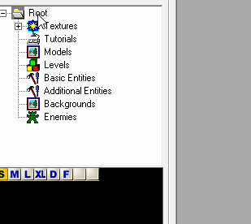
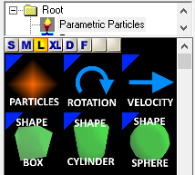
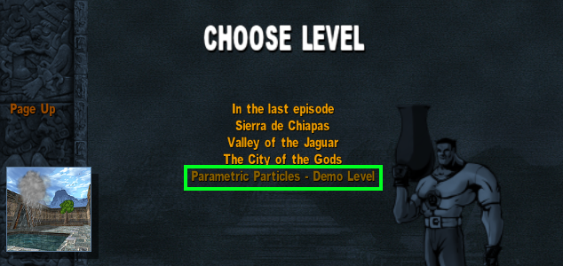
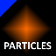
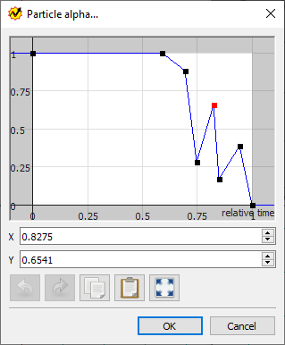
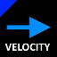
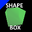
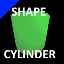
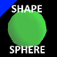

# ParametricParticles

Advanced particle entity for the *Serious Sam - The Second Encounter 1.07*

## Video Demonstration (YouTube, clickable)

---

1. [Introduction](#intro)
2. [Installation](#install)
3. [New entities](#entities)
   1. [ParametricParticles](#particles)
   2. [ParticleRotation](#rotation)
   3. [ParticleVelocity](#velocity)
   4. [SpawnShapeBox](#box)
   5. [SpawnShapeCylinder](#cylinder)
   6. [SpawnShapeSphere](#sphere)

---

# Introduction

This is a collection of a few new entities, that are handy during mapping.

With customizable particles, you can add special effects and a chef's touch to your map!

Waterfalls, smoke, sparkles, clouds, fire, ambient particles, dusty air, fireflies and much more - your imagination is the limit!

# Installation

1. Download an archive from the [latest release](https://github.com/SeriousAlexej/ParametricParticles/releases/latest) page.
2. Extract this archive to the root directory of *Serious Sam - The Second Encounter 1.07*
3. Launch **Serious Editor** and add all new classes to the virtual tree.

# New entities

Particles are implemented with 6 new entities.

To quickly check them out and see some examples, you can startup a **Parametric Particles - Demo Level** level from within the game.

As a short intro on how to use these entities, you can watch a video below.

## Mapping Video Demonstration (YouTube, clickable)

---

### ParametricParticles

This is the main entity, that defines all parameters of the particles.

#### Gist
When this entity is **Active**, it spawnes between **Spawn count min** and **Spawn count max** particles every **Spawn interval (seconds)** seconds.
Each particle is defined by a set of properties, starting from the *Particle* word - like **Particle color**.
Initial particle position is determined by a **Spawner shape** entity, or, if not specified, is taken from the current entity's location.

#### Events

Following events can be sent to this entity:

* **Activate event** - this event activates the entity, so that new particles will be spawned.
* **Deactivate event** - this event stops new particles from spawning, but *existing* particles will continue to exist (until they expire).
* **Stop event** - this event stops new particles from spawning and kills all alive particles.

#### Properties

* **Active** - if *TRUE*, new particles are spawned each **Spawn interval (seconds)**.
* **Background** - if *TRUE*, particles will be rendered as a part of a background. This is useful when making clouds or flying birds etc.
* **Blend type** - defines the blending mode of particle's texture on screen.
* **Clipping box size X (for rendering only)** - this property defines the stretch of this entity, change it only if you experience problems with clipping (i.e. particles disappear sooner than they should when camera is turned away from them).
* **Clipping box size Y** - same as above, but for *Y* axis.
* **Clipping box size Z** - same as above, but for *Z* axis.
* **Flat type** - determines how particles are oriented relative to the viewer.
* **Online Help...** - opens up this github page.
* **Particle alpha...** - edits a graph of relative alpha value during its lifetime.
Graph editing is implemented with an external executable *Graph.exe* that is called from the *Serious Editor*.

With this utility you can edit values of various parameters in time.

If X axis is **relative time**, then this means that X=1 is the end of a particle's lifetime, X=0.75 is a 75% of particle's lifetime and so on.

If X axis is **seconds**, then X=3 is 3 seconds into particle's lifetime, etc.

Greyed out areas of a graph mean that values within them will have no impact on this property in runtime (for example, when X is < 0, then particle does not exist yet).

* **Particle color** - base color of particles. Note: alpha value here is discarded! Use **Particle alpha...** instead!
* **Particle lifetime max** - longest possible lifetime of a particle.
* **Particle lifetime min** - shortest possible lifetime of a particle.
* **Particle placement** - if this property is set to *Relative*, then particles act as if they were parented to this entity. Only meaningful when this entity is moving (i.e. parented to a *MovingBrush* etc).
* **Particle rotation force (chained)** - optional pointer to a chain of **ParticleRotation** entities, that can change particle's rotation during its lifetime.
* **Particle rotation max** - maximum possible initial particle rotation.
* **Particle rotation min** - minimum possible initial particle rotation.
* **Particle size X max** - maximum possible initial width of a particle.
* **Particle size X min** - minimum possible initial width of a particle.
* **Particle size Y max** - maximum possible initial height of a particle.
* **Particle size Y min** - minimum possible initial height of a particle.
* **Particle size uniform** - if set to *FALSE*, then particle's X and Y sizes are chosen independently. If *TRUE*, then if X size is picked at 30% between *X min* and *X max*, then Y shall also be 30% between *Y min* and *Y max*, etc.
* **Particle stretch X...** - edits a graph of particle's Width stretch multiplier during its lifetime.
* **Particle stretch Y...** - edits a graph of particle's Height stretch multiplier during its lifetime.
* **Particle velocity force (chained)** - optional pointer to a chain of **ParticleVelocity** entities, that can change particle's velocity during its lifetime.
* **Spawn count max** - maximum possible count of particles that are spawned each **Spawn interval (seconds)**
* **Spawn count min** - minimum possible count of particles that are spawned each **Spawn interval (seconds)**
* **Spawn interval (seconds)** - determines how often new particles are spawned. For example, a value of 2 means that new particles are spawned every 2 seconds.
* **Spawner shape** - optional pointer to an entity, that defines custom spawn area (**SpawnShapeBox** / **SpawnShapeCylinder** / **SpawnShapeSphere**).
* **Texture** - texture to be used for every particle.
* **Texture animation** - selection of a possible predefined texture animation.
* **Texture animation FPS** - defines how quickly texture tiles are changed, not related to **Texture animation**! Valid only if **Texture type** is set to *Animated tiles*.
* **Texture columns** - how many tiles the texture has horizontally.
* **Texture rows** - how many tiles the texture has vertically.
* **Texture tiles count** - total number of tiles. Usually this is a product of **Texture columns** and **Texture rows**, but if some last tiles are not used, you can exclude them with this property.
* **Texture type** - defines which tile of a **Texture** is rendered for particles. *Random tile* picks 1 tile and it does not change during particle's lifetime. *Animated tiles* playes back tiles from first to last (looping) using previous properties.

---

### ParticleRotation

This is an additional entity, representing a dynamic rotation speed, that can affect particles.

#### Gist
This entity is helpful when you want to rotate particles during their lifetime.

Multiple rotation forces can be used by bulding up a chain of **ParticleRotation** entities.

*Note - order or these entities in chain is not important, they all act simultaniously.*

#### Properties

* **Next rotation force (chained)** - a pointer to another **ParticleRotation** entity, that should also be used (order is not important, all entities act simultaniously). Loops in chains are not allowed.
* **Probability of this rotation** - probability from 0 to 1. For example, value of 0.77 means that each particle has a 77% probability of being affected by this rotation. Does not affect other rotations in the chain.
* **Rotation speed max** - maximum possible initial speed for this rotation.
* **Rotation speed min** - minimum possible initial speed for this rotation.
* **Rotation speed stretch...** - edits a graph of this rotation speed stretch factor during particle's lifetime. Can also have negative values to invert the rotation.
* **Loop speed stretch graph** - if *TRUE*, then graph of this rotation's speed stretch is looped.

---

### ParticleVelocity

This is an additional entity, representing a dynamic velocity, that can affect particles. Direction of velocity is defined by this entity's orientation.

#### Gist
This entity is helpful when you want to move particles during their lifetime.

Multiple velocities can be used by building up a chain of **ParticleVelocity** entities.

*Note - order of these entities in chain is not important, they all act simultaniously.*

#### Properties

* **Next velocity force (chained)** - a pointer to another **ParticleVelocity** entity, that should also be used (order is not important, all entities act simultaniously). Loops in chains are not allowed.
* **Probability of this velocity** - probability from 0 to 1. For example, value of 0.88 means that each particle has a 88% probability of being affect by this velocity. Does not affect other velocities in the chain.
* **Velocity random heading max** - maximum possible initial heading deviation for this velocity's direction (which is defined by this entity's orientation).
* **Velocity random heading min** - minimum possible initial heading deviation for this velocity's direction (which is defined by this entity's orientation).
* **Velocity random pitch max** - maximum possible initial pitch deviation for this velocity's direction (which is defined by this entity's orientation).
* **Velocity random pitch min** - maximum possible initial pitch deviation for this velocity's direction (which is defined by this entity's orientation).
* **Velocity speed stretch...** - edits a graph of this velocity speed stretch factor during particle's lifetime. Can also have negative values to invert the velocity.
* **Loop speed stretch graph** - if *TRUE*, then graph of this velocity's speed stretch is looped.

---

### SpawnShapeBox

This is an additional entity, representing a box-shaped spawn volume. Particles are spawned uniformly within it.

#### Properties

* **Size X** - X size of this box.
* **Size Y** - Y size of this box.
* **Size Z** - Z size of this box.

---

### SpawnShapeCylinder

This is an additional entity, representing a cylinder-shaped spawn volume. Particles are spawned uniformly within it.

#### Properties

* **Diameter** - diameter of this cylinder.
* **Height** - height of this cylinder.

---

### SpawnShapeSphere

This is an additional entity, representing a sphere-shaped spawn volume. Particles are spawned uniformly within it.

#### Properties

* **Diameter** - diameter of this sphere.
